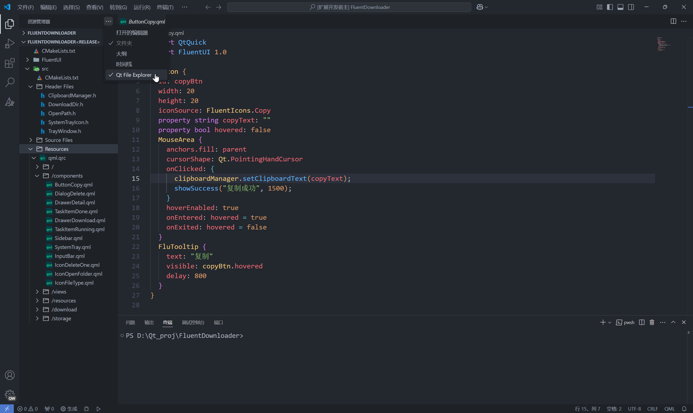

# Qt File Explorer
English | [简体中文](#简体中文)

## Introduction
This is an extension that provides a resource explorer view similar to Qt Creator for Qt+cpp projects. Its principle is to parse the file structure by analyzing the build results of specific build systems and Qt resource files (.qrc). Currently, it supports CMake, and it is expected to add support for qmake and XMake in the future, as well as relevant support for .qrc files.

## Effect Display
Open a Qt project containing `CMakeLists.txt` in the root directory. Open this extension's view in the Explorer sidebar to display the file resource tree view of the current project.

## Notes
- When using it for the first time, you may need to click the three dots in the upper right corner of the Sidebar - Explorer to enable Qt File Explorer.
- Since the parsing logic depends on build results, there must be build results and a properly set build directory to obtain the correct file structure.
- Some folder icons are hollow, such as "Header Files", which indicates that this is not an actual directory but a virtual directory created based on parsing results. Those with solid icons or icons consistent with your file icon theme indicate real existing directories. Although the .qrc file uses a file icon, it can be collapsed/expanded. To open it for editing, use the right-click menu.

## Recommended Extensions
- ms-vscode.cpptools - For providing C++ language support
- theqtcompany.qt - Qt support
- ms-vscode.cmake-tools - CMake support
- tboox.xmake-vscode - XMake support

## References
- [GitHub address of the Qt Creator project](https://github.com/qt-creator/qt-creator) - Referenced for parsing CMake logic

# Qt文件资源管理器 
[English](#qt-file-explorer) | 简体中文

## 简介
这是一个为Qt+cpp项目提供类似Qt Creator的资源管理器视图的扩展。原理是通过解析特定构建系统的构建结果和Qt资源文件.qrc来解析出文件结构。目前支持CMake，预计后面会添加qmake和XMake支持，并且添加对.qrc文件的相关支持。

## 效果展示
打开一个根目录下含有CMakeLists.txt的Qt项目，在侧边栏的资源管理器中打开此扩展的视图，即可显示当前项目的文件资源树视图。

## 注意事项
- 首次使用时，可能需要在侧边栏-资源管理器-右上角的三个点，单击启用Qt File Explorer。
- 由于解析逻辑依赖于构建结果，所以必须要有构建结果并且设定了合适的构建目录，才能得到正确的文件结构。
- 有些文件夹图标是空心的，比如Header Files，说明这不是实际的目录，而是根据解析结果创建的虚拟目录，实心的或者和你的文件图标主题一致的，说明是真实存在的目录。而.qrc文件虽然使用的是文件图标，但是可以折叠/展开，需要打开编辑的话使用右键菜单。

## 推荐扩展
- ms-vscode.cpptools - 用于提供C++语言支持
- theqtcompany.qt - Qt支持
- ms-vscode.cmake-tools - CMake支持
- tboox.xmake-vscode - XMake支持

## 引用
- [Qt Creator项目的GitHub地址](https://github.com/qt-creator/qt-creator) - 参考解析CMake逻辑